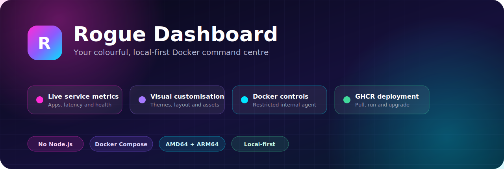
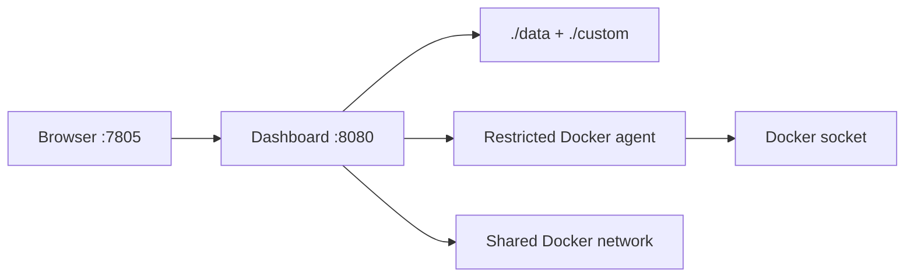

<div align="center">



# Rogue Dashboard

**A colourful, local-first command centre for the containers you run.**

[](https://github.com/RogueAssassin/rogue-dashboard)
[](https://github.com/RogueAssassin/rogue-dashboard/pkgs/container/rogue-dashboard)
[](#why-rogue-dashboard)
[](#install-from-scratch)

Version **0.7.0** · Docker Compose deployment · Browser-based setup

</div>

Rogue Dashboard turns a Docker host into an approachable control panel. It brings service links, live application metrics, container health, safe lifecycle controls, themes, search and configuration into one responsive page—without requiring Node.js, TypeScript, pnpm or a frontend build on your server.

## Why Rogue Dashboard?

| | What you get |
| --- | --- |
| 🎨 | **Make it yours** — six colour presets, two accent colours, neon glow, card opacity, density and custom backgrounds. |
| 📦 | **See Docker clearly** — discover every container, see its networks and state, and create duplicate-safe cards. |
| ⚡ | **Live service data** — metrics for qBittorrent, Radarr, Sonarr, Prowlarr, Seerr, Bazarr, Tautulli and Pi-hole. |
| 🧩 | **Edit in the browser** — add cards, rearrange groups, change columns and preview appearance changes live. |
| 🛡️ | **A safer Docker boundary** — the web app never mounts the Docker socket; a private, restricted agent handles approved operations. |
| 🚚 | **Simple upgrades** — pull a prebuilt GHCR image while keeping the database, settings and custom assets on the host. |
| 🧭 | **Bring an existing layout** — optionally import Homepage YAML files or a configuration ZIP during setup. |
| 📴 | **Local-first** — no cloud account, analytics service, subscription or remote icon dependency is required. |

## Install from scratch

### Requirements

- Docker Engine or Docker Desktop
- Docker Compose v2 (`docker compose`)
- Git for the recommended installation method
- Linux, WSL 2, or another Docker host that supports bind mounts

### 1. Download the deployment files

```bash
git clone https://github.com/RogueAssassin/rogue-dashboard.git
cd rogue-dashboard
```

### 2. Run the installer

```bash
chmod +x install.sh upgrade.sh migrate-env.sh
./install.sh
```

The installer creates `.env`, detects your user and Docker socket group IDs, generates the private agent token, prepares persistent folders, creates the shared Docker network, pulls the public image from GHCR and waits for a healthy start.

### 3. Open the dashboard

Visit [http://localhost:7805](http://localhost:7805), create the first local administrator and either start with a blank dashboard or import an existing Homepage configuration.

> Rogue Dashboard defaults to host port `7805`. Change `RGDASH_PORT` in `.env`, then run `docker compose up -d` to use another port.

## What Docker starts



The same prebuilt image runs in two modes:

- `dashboard` serves the interface, login, imports, SQLite data, health checks and integrations.
- `docker-agent` is internal-only and permits container listing plus start, stop and restart operations. It has no published host port.

## Day-to-day commands

```bash
# View status
docker compose ps

# Follow logs
docker compose logs -f

# Restart without deleting saved data
docker compose restart

# Stop the stack while preserving data
docker compose down
```

Normal installations pull `ghcr.io/rogueassassin/rogue-dashboard:latest`; they do not build application code. To pin this release, add this to `.env`:

```dotenv
RGDASH_IMAGE=ghcr.io/rogueassassin/rogue-dashboard:0.7.0
```

## Connect live service widgets

Keep API credentials in `.env`, never in card exports. Restart the dashboard after editing the file.

```dotenv
# qBittorrent 5.2+ uses the API key first.
RGDASH_QBITTORRENT_API_KEY=qbt_your_generated_key

# Optional automatic fallback for older servers or a rejected API key.
RGDASH_QBITTORRENT_USERNAME=
RGDASH_QBITTORRENT_PASSWORD=

RGDASH_PROWLARR_KEY=
RGDASH_RADARR_KEY=
RGDASH_SONARR_KEY=
RGDASH_SEERR_KEY=
RGDASH_BAZARR_KEY=
RGDASH_TAUTULLI_KEY=
RGDASH_PIHOLE_KEY=
```

Then open **Customise → Connect → Test now**. The connection centre reports DNS reachability, port access, API authentication, response time and the names of missing environment variables. Secret values are never sent to the browser.

Service URLs should normally use Docker DNS, such as `http://radarr:7878`, rather than a public proxy address. The dashboard and target service must share a Docker network.

If an application stack lives on a second isolated network, set its existing network name in `.env`:

```dotenv
RGDASH_EXTRA_NETWORK=application-network
```

Then run `./upgrade.sh` or `./install.sh`. The scripts automatically load `docker-compose.extra-network.yaml` and attach only the web dashboard to that network. The restricted Docker agent remains isolated. See [Multiple Docker networks](docs/INSTALLATION.md#multiple-docker-networks) for discovery and verification commands.

RogueRoute GPX containers receive dedicated local icons and private health endpoints when added through **Customise → Docker**. Set `RGDASH_ROGUEROUTE_URL` to provide the public link for the Web card; OSRM and Manager remain status-only. Docker discovery displays each container's attached networks and marks containers that already have a card.

## Themes, icons and backgrounds

Open **Customise → Appearance** to choose Electric Neon, Midnight, Graphite, Ocean, Ember or Daylight. You can tune both neon colours, glow strength, surface opacity, density and the background effect.

Bundled service icons work offline. Unknown services receive an initials fallback. For your own artwork:

1. Copy an SVG, PNG or WebP file into `custom/icons/`.
2. Edit a card and enter `/custom/icons/my-service.svg` in **Icon URL or local path**.
3. For a background, place the file in `custom/backgrounds/`, enter `/custom/backgrounds/my-background.webp` under Appearance and select **Custom image**.

The `custom` directory is mounted read-only inside the app and survives image updates.

## Reverse proxy

Attach your proxy container to the same `${MEDIA_NETWORK:-media-net}` Docker network, then forward to:

| Setting | Value |
| --- | --- |
| Scheme | `http` |
| Hostname | `rogue-dashboard` |
| Port | `8080` |
| WebSockets | enabled |

Use a domain you control, such as `dashboard.example.com`. The proxy must target container port `8080`, not host port `7805`. See [Reverse proxy guide](docs/REVERSE_PROXY.md) for Nginx and Nginx Proxy Manager examples.

## Upgrade without losing settings

Your administrator account and dashboard layout live in `data/`; custom artwork lives in `custom/`; integration values live in `.env`. Keep those paths and run:

```bash
git pull --ff-only
./upgrade.sh
```

The upgrade pulls first, creates a timestamped backup, migrates supported legacy environment names, replaces the containers, verifies health and restores the previous local image if startup fails.

Do not run `docker compose down -v` as part of an upgrade. Read [Upgrading and recovery](docs/UPGRADING.md) before moving an installation between hosts.

## Documentation

- [Installation and networking](docs/INSTALLATION.md)
- [Configuration reference](docs/CONFIGURATION.md)
- [Reverse proxy guide](docs/REVERSE_PROXY.md)
- [Upgrading and recovery](docs/UPGRADING.md)
- [Security model](docs/SECURITY.md)
- [Architecture](docs/ARCHITECTURE.md)
- [Changelog](CHANGELOG.md)
- [0.7.0 release notes](docs/RELEASE_0.7.0.md)
- [0.6.0 release notes](docs/RELEASE_0.6.0.md)
- [0.5.0 release notes](docs/RELEASE_0.5.0.md)
- [Roadmap](docs/ROADMAP.md)

## Contributing and local builds

Repository contributors can build the exact source tree with the explicit override:

```bash
cp .env.example .env
docker network create media-net 2>/dev/null || true
docker compose -f docker-compose.yaml -f docker-compose.build.yaml up -d --build
python -m unittest discover -s tests -v
```

The browser interface is plain HTML, CSS and JavaScript served by Python. There is no Node-based build step.

## Acknowledgements

Rogue Dashboard is an original implementation shaped by useful ideas from several self-hosted dashboard projects. See [Third-party inspiration](THIRD_PARTY_INSPIRATION.md) for the design review record. Product names and trademarks belong to their respective owners.
