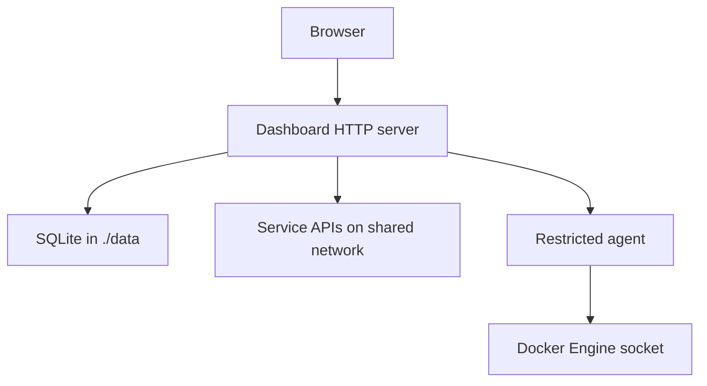

# Architecture

Rogue Dashboard is a Docker-first, standard-library Python application with a browser-native frontend. Production hosts pull one prebuilt image; no language runtime or frontend package manager is installed on the host.

## Runtime services

| Service | Exposure | Responsibility |
| --- | --- | --- |
| `dashboard` | Host `${RGDASH_PORT:-7805}` → container `8080` | UI, authentication, imports, persistence, monitoring and integration clients |
| `docker-agent` | Internal `8081` only | Allow-listed Docker metadata and container lifecycle operations |

The browser talks only to `dashboard`. The dashboard calls the agent over the private Compose network with a generated bearer token. The dashboard may join the primary shared network and one optional extra application network. The agent is attached to neither shared network and has no host port.

## Request and data flow

## Source layout

- `app/dashboard.py` — HTTP API, SQLite storage, sessions, validation, monitoring and agent mode.
- `app/homepage_yaml.py` — constrained data-only parser for the supported Homepage YAML subset.
- `app/importer.py` — conversion into the internal dashboard model and environment references.
- `app/integrations.py` — server-side API clients, authentication fallback, timing and sanitised metrics.
- `app/static/` — plain HTML, CSS, JavaScript and bundled offline icons.
- `custom/` — persistent user artwork, mounted read-only and served under `/custom/`.
- `docker-compose.yaml` — production pull-based runtime.
- `docker-compose.build.yaml` — explicit source-build override for contributors.

## Persistence and secrets

SQLite runs in write-ahead logging mode inside bind-mounted `data/`. Administrator passwords use `scrypt` with unique random salts. Session tokens are random, stored as hashes and expire after 14 days.

Integration credentials are resolved from environment variables only when a collector runs. Widget responses may contain display metrics, state, timing and configured or missing variable names, but never the values. Results are cached briefly to avoid unnecessary service polling.

The upgrade script creates a private timestamped backup before changing the running image and remembers the previous local image ID for automatic startup rollback. Compose bounds Docker's JSON logs to three 10 MB files per service and applies process limits to reduce accidental resource exhaustion.

Dashboard schema 6 stores named pages separately from groups. Each group carries a `pageId`; older layouts receive a generated Home page during validation. JSON restores pass through the same server-side length and schema validation as normal dashboard saves.

## Docker boundary

The agent implements only:

- `GET /health`
- authenticated `GET /containers`
- authenticated `POST /containers/{id}/start`
- authenticated `POST /containers/{id}/stop`
- authenticated `POST /containers/{id}/restart`

There is no general Docker proxy, command execution route, image deletion route or arbitrary Engine API passthrough.

Container discovery returns only an allow-listed metadata summary: ID prefix, name, image, state, published ports, attached network names and selected Compose/Rogue Dashboard labels. It does not expose container environment variables, mounts or secret values.
